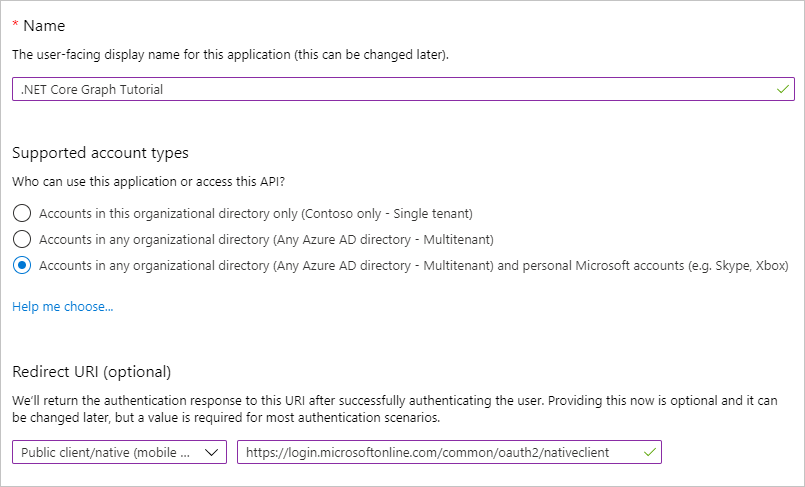

<!-- markdownlint-disable MD002 MD041 -->

In dieser Übung erstellen Sie mithilfe des Azure Active Directory Admin Center eine neue Azure AD Anwendung.In this exercise you will create a new Azure AD application using the Azure Active Directory admin center.

1. Öffnen Sie einen Browser, und navigieren Sie zum [Azure Active Directory Admin Center](https://aad.portal.azure.com). Melden Sie sich mit einem **persönlichen Konto** (auch: Microsoft-Konto) oder einem **Geschäfts- oder Schulkonto** an.Open a browser and navigate to the [Azure Active Directory admin center](https://aad.portal.azure.com) and login using a **personal account** (aka: Microsoft Account) or **Work or School Account**.

1. Wählen Sie in der linken Navigationsleiste **Azure Active Directory** aus, und wählen Sie dann **App-Registrierungen** unter **Verwalten** aus.Select **Azure Active Directory** in the left-hand navigation, then select **App registrations** under **Manage**.

    

1. Wählen Sie **Neue Registrierung** aus.Select **New registration**. Legen Sie auf der Seite **Anwendung registrieren** die Werte wie folgt fest.On the **Register an application** page, set the values as follows.

    - Legen Sie **Name** auf `.NET Core Graph Tutorial` fest.Set **Name** to `.NET Core Graph Tutorial`.
    - Legen Sie **Unterstützte Kontotypen** auf **Konten in allen Organisationsverzeichnissen und persönliche Microsoft-Konten** fest.Set **Supported account types** to **Accounts in any organizational directory and personal Microsoft accounts**.
    - Lassen Sie **URI umleiten** leer.Leave **Redirect URI** empty.

    

1. Wählen Sie **registrieren**aus.Select **Register**. Kopieren Sie auf der Seite " **.net Core Graph Tutorial** " den Wert der **Anwendungs-ID (Client)** , und speichern Sie Sie, um Sie im nächsten Schritt zu benötigen.On the **.NET Core Graph Tutorial** page, copy the value of the **Application (client) ID** and save it, you will need it in the next step.

    

1. Klicken Sie auf den Link **Umleitungs-URI hinzufügen** .Select the **Add a Redirect URI** link. Suchen Sie auf der Seite " **Umleitungs-URIs** " den Abschnitt **vorgeschlagene Umleitungs-URIs für öffentliche Clients (Mobile, Desktop)** .On the **Redirect URIs** page, locate the **Suggested Redirect URIs for public clients (mobile, desktop)** section. Wählen Sie `https://login.microsoftonline.com/common/oauth2/nativeclient` den URI aus.Select the `https://login.microsoftonline.com/common/oauth2/nativeclient` URI.

    

1. Suchen Sie den **standardmäßigen Clienttyp** Abschnitt, und ändern Sie die Option **Anwendung als öffentlichen Client** Umschalten auf **Ja**, und wählen Sie dann **Speichern**aus.Locate the **Default client type** section and change the **Treat application as a public client** toggle to **Yes**, then choose **Save**.

    
